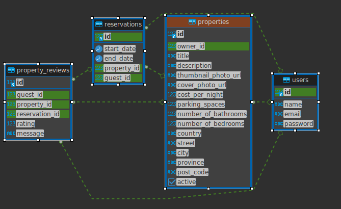

# LightBnB

A database application project developed as a part of _[Lighthouse Labs Web Development](https://www.lighthouselabs.ca/en/web-development)_ course. The front-end is forked from [lighthouse-labs/LightBnB_WebApp](https://github.com/lighthouse-labs/LightBnB_WebApp)

Install the LightBnB_WebApp `npm install`, run it `npm run local`, and view it at `localhost:3000`!

## Project Structure
* Setup related files
  * `docs` documentation info
  * `migrations` files related to creating the database
  * `seeds` database with fake data
  * `queries` sample database queries
* `LightBnB_WebApp`
  * `public` contains the required HTML, CSS, and client side JavaScript
    * `index.html` the heart of the single-page application
    * `javascript` contains the JS client-side files
      * `index.js` renders the listings at the start of the application
      * `network.js` manages the ajax requests to the server
      * `views_manager.js` manages which components appear on screen
      * `components` contains individual HTML components, created using jQuery
      *  `libraries` contains essential JS components, inherited by the fork
  * `styles` contains the necessary sass files
  * `routes` contains all of the server side and database code.
    * `apiRoutes.js` and `userRoutes.js` are responsible for any HTTP requests to `/users/something` or `/api/something`. 
  * `server.js` Connecting the routes to the database, this is the entry point to the application
* `database.js` is responsible for all queries to the database. It doesn't currently connect to any database, all it does is return data from `.json` files.

# ERD
## Diagram

## ERD Info
- _`users`_
  - `id`: Primary Key
  - `name`
  - `email`
  - `password`
  
- _`properties`_
  - `id`: Primary Key
  - `title`
  - `description`
  - `thumbnail_photo_url`
  - `cover_photo_url`  
  - `owner_id` : Foreign Key _`users(id)`_
  - `cost_per_night`
  - `country`
  - `street`
  - `city`
  - `province`
  - `postal_code`
  - `parking_spaces`
  - `number_of_bedrooms`
  - `number_of_bathrooms`

- _`reservations`_
  - `id`: Primary Key
  - `start_date`
  - `end_date`
  - `property_id` : Foreign Key _`properties(id)`_
  - `guset_id` : Foreign Key _`users_id(id)`_

- _`property_reviews`_
  - `id`: Primary Key
  - `guest_id` : Foreign Key _`users(id)`_
  - `property_id` : Foreign Key _`properties(id)`_
  - `reservation_id` : Foreign Key _`reservations(id)`_
  - `message`
  - `rating`